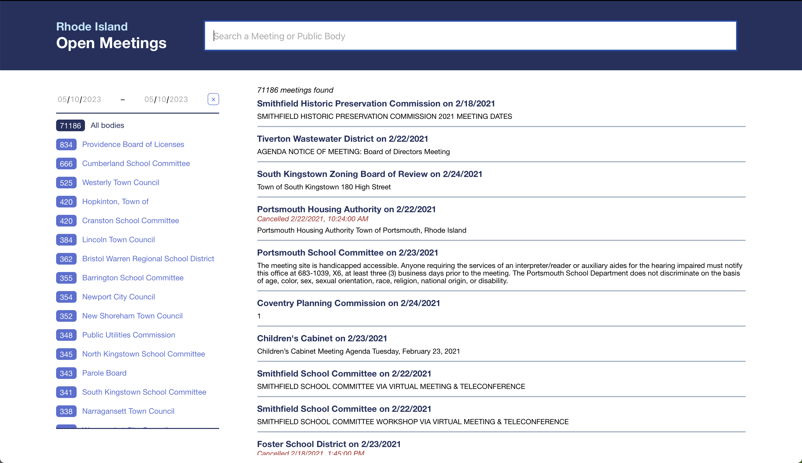

# How to run a sample of this program

1. Download [Docker](https://www.docker.com/products/docker-desktop/). For more help, see containers/README.md.
2. run:

        echo 'export TYPESENSE_API_KEY=xyz' >> ~/.bashrc
        source ~/.bashrc

3. in typesense/ run:

        npm start
        npm index

4. in controller/ run server.java
5. in frontend/ run:

        npm start

Navigate to http://localhost:3000. It should look like this:

