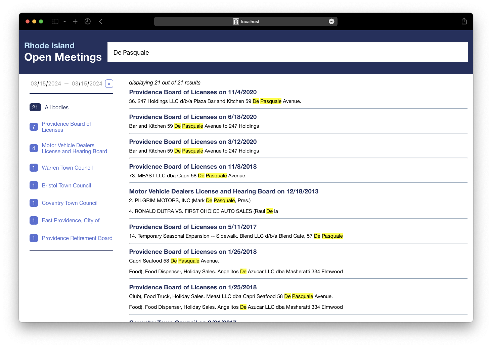

# Open Meetings


## About this Project

Open Meetings is a full-stack web application for accessing information about the meetings of public bodies in Rhode Island, including with keyword search. It was developed by Michael Kearney, Lizzy Zhang, Austin Miles, and Ronnie Shashoua for a software development class taught by Tim Nelson at Brown University in Spring 2023.

This project was motivated by personal frustrations with the RI Secretary of State's [Open Meetings Portal](https://opengov.sos.ri.gov/openmeetings), which does not have a search feature. The development process began with stakeholder interviews with journalists, elected officials, community advocates, civil servants, and a government watchdog group. After creating user stories and an architecture to meet stakeholder needs, modules and testing were developed by pairs of the team members in parallel.

This project was developed with extensibility in mind. It may be updated and deployed in the future. For now, note that the database of meetings is not updated and there is no support for recent meetings. Note also there is no guarantee that every published meeting in the supported time range is included in the database.

## Architecture

The project contains three major components:
1. The Data Acquisition Pipeline
   - A web-scraping module written in Python scrapes meeting information and links to PDFs of agendas and minutes from the RI Secretary of State's website and processes the information into a SQL database.
   - A PDF parsing module downloads agenda and minutes PDFs and uses Apache Tika to extract their text and store it in a MongoDB instance running in a Docker container.
   - An indexing module indexes agenda and meeting information into a Typesense instance running in another Docker container.
2. The Backend Server
   - A Java server using Spark responds to search queries, using Typesense to identify matching meetings and pulling information from the MongoDB database.
3. The Frontend Interface
   - A frontend written in Typescript with React allows searching by keyword and filtering of open meetings, as well as access to original PDFs of the agenda and minutes.

## Preview and Features

View a recording of the app in action at [preview/app.mov](preview/app.mov).

See upcoming meetings:


Search meetings by keyword:


View meetings and the text of their agendas and minutes:


Filter search results by date:


## How to run this program

These instructions are for MacOS. For Windows systems, see instructions in [containers/README.md](containers/README.md).

1. Create a dummy Typesense API key. This key is only used locally. Run:
    ```
    echo 'export TYPESENSE_API_KEY=xyz' >> ~/.bashrc
    source ~/.bashrc
    ```
2. Setup and start the Docker containers.
    - Download [Docker](https://www.docker.com/products/docker-desktop/).
    - Start the Docker daemon by launching the Docker application.
    - Run:
        ```
        sh containers/setup.sh
        sh containers/run.sh -a
        ```
3. Index the sample data. In `typesense/` run:
    ```
    npm install
    npm start
    npm run index
    ```
4. Start the backend server. With your IDE, run `Server.java` in `controller/src/main/java/edu/brown/cs/server/`. If you encounter an error, you may need to restart your IDE to source `.bashrc` and the API key into the shell automatically.
5. Start the frontend interface. In `frontend/` run:
    ```
    npm install
    npm start
    ```
6. If the frontend does not open automatically, navigate to http://localhost:3000.
